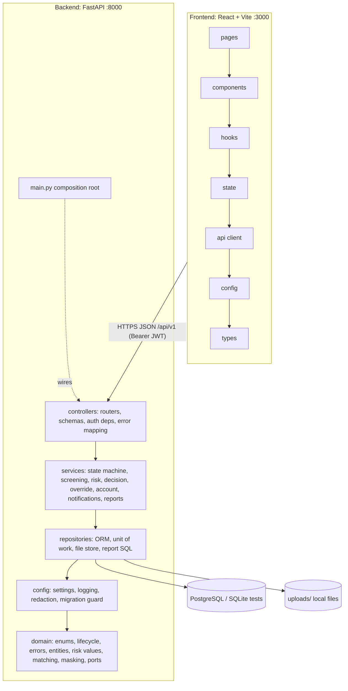
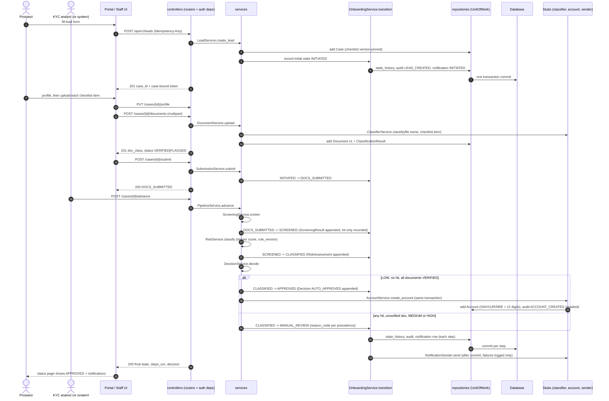
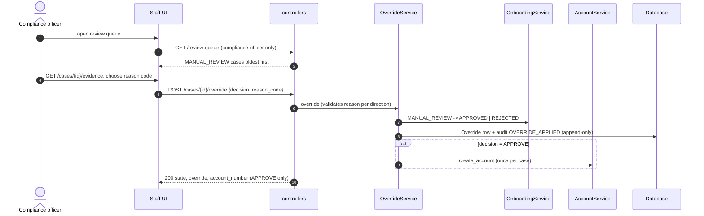

# OnboardX System Design

Status: DRAFT for `/design` approval. Inputs: `specs/brd/brd.md`, `specs/app_spec.md`, `specs/*_spec.md`, `specs/stories/`, `specs/features.json`, `project-manifest.json`. Sections 3 to 6 are written to be copied verbatim into `docs/architecture.md`.

## 1. Scope and constraints

| Item | Decision |
|---|---|
| Product | Bank onboarding and KYC pipeline: lead, documents, stub classification, AML/PEP screening, versioned integer risk scoring, auto-approval, compliance override, stub account, admin reports |
| Stack | Python 3.12, FastAPI, SQLAlchemy 2, Alembic; React 18, TypeScript, Vite; PostgreSQL (runtime), SQLite (tests); local verification mode (backend :8000, frontend :3000, `/health`) |
| Backend env | Python `venv` at `backend/.venv` (user instruction), dependencies in `pyproject.toml`, pinned in `requirements.lock` |
| Data | Synthetic only. PII-like fields (name, contact, income, occupation, PAN, Aadhaar) still treated as real: masked on read, redacted in logs |
| Users | prospect (responsive portal), kyc-analyst, compliance-officer, admin (desktop-first staff UI). WCAG 2.1 AA everywhere |
| Non-goals | Real OCR, CKYC, video KYC, e-signature, core banking, production deployment, secrets management, multi-region, real notification channel |

## 2. Architecture decisions and alternatives considered

The `/design` brainstorming step was folded into this table because the workflow option (B), auth, notifications and stack were already approved; the remaining choices were compared here.

| Decision | Chosen | Alternatives rejected | Why |
|---|---|---|---|
| Workflow engine | Persisted state machine, one transition function, steps as on-demand service calls (approved Option B) | Inline synchronous pipeline (A), queue workers (C) | Auditable, testable, no extra infrastructure |
| Backend shape | Modular monolith, layers `controllers > services > repositories > config > domain` | Microservices; hexagonal with ports everywhere | One process fits local mode; ports only where a real seam exists (Clock, FileStore, NotificationSender, TransitionObserver) |
| Layer enforcement | import-linter contracts plus AST test | Convention only | Agent-generated code drifts; machine check in CI and in pytest (E5-S5) |
| Append-only (NFR-02) | Database triggers on every AO table plus repositories without update/delete methods | App-level only; event sourcing | Triggers also stop raw SQL; event sourcing is heavier than needed. Derived views (current document status, superseded, current assessment) replace in-place updates |
| Risk arithmetic | Python `int` only, domain value objects reject non-int, `StrictInt` at the API | Decimal | NFR-01 forbids float and Decimal |
| Auth | HS256 JWT, seeded users, role dependency in controllers; prospect token bound to `case_id` | Sessions; OAuth | Approved token-based local auth; stateless, testable |
| Prospect identity | `POST /leads` (public) returns a case-bound prospect token (DD-6) | Force prospects to log in before creating a lead | Spec says a public lead form; the bound token satisfies "prospect token is bound to one case_id" |
| Pipeline trigger | Explicit `advance` by analyst or admin; optional `AUTO_ADVANCE_ON_SUBMIT` setting (default false) runs advance after submit through the in-process system actor | Always auto-advance | Keeps submit tests deterministic; demo cohort and `init.sh` enable it |
| Notifications | Row inserted in the transition transaction (exactly once), stub sender called after commit, failure logged and swallowed | Send inside transaction | AC-09.5: a sender failure must not roll back |
| Watchlist matching | Normalised token-set equality on name or alias | Fuzzy match | Spec v1, deterministic |
| File storage | Local filesystem under `uploads/{case_id}/{document_id}.{ext}`, names server-generated | Object storage | Local mode, traversal-safe by construction |
| Frontend | Vite SPA, React Router, fetch client, hooks, no global store beyond auth context | Redux, SSR | Small surface; keeps pages testable |
| Charts | Hand-built SVG/CSS with always-present data table | Chart library | No colour-only meaning, no dependency, easy axe compliance |

## 3. Layered structure

### 3.1 Backend layers

| Layer | Package | Responsibility | May import |
|---|---|---|---|
| 1 domain | `onboardx.domain` | Enums, lifecycle table, errors, frozen entities, integer risk value objects, name matching, masking, account-number derivation, ports (Protocols) | standard library only |
| 2 config | `onboardx.config` | Typed settings, logging and redaction, constants, migration guard | domain |
| 3 repositories | `onboardx.repositories` | ORM models, repositories, unit of work, file store, read-only report SQL | domain, config |
| 4 services | `onboardx.services` | Business rules and orchestration (state machine, screening, risk, decision, override, account, notification, reports, pipeline) | domain, config, repositories |
| 5 controllers | `onboardx.controllers` | FastAPI routers, schemas, auth dependencies, error mapping, middleware | all lower layers |
| root | `onboardx.main` | Composition root (`create_app`) | everything |

Rules (each one is a machine-checked contract, see `folder-structure.md` section 2):
1. Imports flow downward only.
2. Only `repositories` imports SQLAlchemy; `domain`, `config`, `services`, `controllers` never do.
3. `domain` imports no framework or I/O library.
4. `services` and `config` never import FastAPI or Starlette.
5. Authentication and authorisation live only in `controllers/dependencies/auth.py`; nothing in `services` or `repositories` imports it (E1-S2 AC3).
6. Every state change goes through `OnboardingService.transition`; repositories expose no state update to other callers.
7. Append-only repositories have no update or delete method.
8. No float, Decimal, or float literal in risk and report modules.

### 3.2 Frontend layers

`types < config < api < state < hooks < components < pages`; a file imports only from layers to its left; pages call hooks, hooks call `api`, only `api/client.ts` calls `fetch`. Enforced by ESLint `import/no-restricted-paths`.

### 3.3 Layer diagram



## 4. Runtime components and data flow

| Component | Role |
|---|---|
| Prospect portal | Lead form, profile, checklist upload, status, notifications |
| Staff UI | Analyst workbench and case detail, compliance review queue and panel |
| Admin console | Dashboard (5 panels), rule sets, watchlist |
| API | Stateless FastAPI app; one request = one unit of work = one DB transaction |
| Database | All state; triggers enforce append-only and immutability |
| Upload store | Local directory, server-generated names |
| Stubs | Classifier (file-name prefix), account creation (SHA-256 derived number), notification sender (structured log with masked contact) |

Request path: `middleware` (correlation id) -> router -> `require_roles` dependency -> service(s) inside a `UnitOfWork` -> repositories -> DB. Errors are domain exceptions mapped to the error envelope in one place.

### 4.1 Lifecycle state machine

```mermaid
stateDiagram-v2
  [*] --> INITIATED: POST /leads
  INITIATED --> DOCS_SUBMITTED: submit
  DOCS_SUBMITTED --> SCREENED: screen (hit is recorded here, not routed)
  SCREENED --> CLASSIFIED: classify
  CLASSIFIED --> APPROVED: decide (LOW, no hit, all VERIFIED) + stub account
  CLASSIFIED --> MANUAL_REVIEW: decide (AML_HIT, PEP_HIT, DOC_UNRECOGNISED, RISK_MEDIUM, RISK_HIGH)
  CLASSIFIED --> REJECTED: permitted edge (no caller in v1; kept for AC-04)
  MANUAL_REVIEW --> APPROVED: override APPROVE + stub account
  MANUAL_REVIEW --> REJECTED: override REJECT
  APPROVED --> [*]
  REJECTED --> [*]
```

`CLASSIFIED -> REJECTED` exists in the transition table (AC-04.1) but no v1 endpoint uses it; the decision step never rejects. It is unit-tested at the service level only.

### 4.2 Sequence: lead to account creation (auto-approval path)



Each pipeline step commits separately so a failure leaves the case at the last good state and `advance` resumes (idempotent).

### 4.3 Sequence: manual review override



## 5. Cross-cutting concerns

| Concern | Design |
|---|---|
| Transactions | `UnitOfWork` per request/step; state update, history row, audit row and notification row commit together (AC-04.3); forced failure rolls all back |
| Idempotency | `transition` keyed by `(case_id, target_state)` via unique state-history row; leads via `Idempotency-Key` table; `decide` via unique decision per case; `create_account` via unique account per case; `advance` by re-reading state |
| Locking | `CaseLockedError` in `OnboardingService` guard for any mutating service when state is APPROVED or REJECTED; DB trigger on `cases` as second line |
| Auth (NFR-04) | `require_roles(...)` and `require_case_access()` dependencies only in controllers. 401 missing/expired, 403 wrong role or other case. Passwords: salted hash, never logged |
| PII (NFR-03) | Redaction filter in `config/redaction.py` (PAN `[A-Z]{5}[0-9]{4}[A-Z]`, 12-digit Aadhaar, phone, email, income and occupation values); logs carry `case_id` and counts, never names, contacts or filenames; audit payloads are PII-free; reports select no PII columns |
| Logging (NFR-06) | One JSON object per line: `timestamp, level, correlation_id, message` plus `case_id` when case-scoped; `X-Correlation-ID` accepted or generated and echoed |
| Health (NFR-07) | `/health` has no DB dependency at import time; answers within 1 s of process start |
| Migrations (NFR-05) | Alembic, append-only; `migration_guard` compares SHA-256 of every migration with `manifest.json` at startup and in tests |
| Integer math (NFR-01) | `int` only; `//` floor division; ratios in bp; durations in seconds; CI static scan on `domain/risk.py`, `services/risk_service.py`, `services/reports/`, `repositories/report_queries.py` |
| Error model | `{error:{code,message,details}}`, codes in `api-contracts.md` section 1.1, single mapping module |
| Time | Injected `Clock` (UTC) for deterministic tests |
| Accessibility | Design tokens with checked contrast, visible focus, skip link, labelled controls, dialog focus trap, tables for every chart; axe-core in vitest and Playwright |

## 6. Architecture enforcement and commands

Run from `backend/` with the venv active (`source .venv/Scripts/activate` on Windows Git Bash, `.venv\Scripts\Activate.ps1` in PowerShell):

```
python -m venv .venv
pip install -r requirements.lock && pip install -e ".[dev]"
lint-imports                 # import-linter contracts (layering, purity, SQLAlchemy confinement)
pytest -x -q                 # includes tests/architecture (AST scan, append-only, locked case, PII logs)
ruff check --fix . && mypy src/
```

Frontend: `npm run lint` (layer zones), `npm run typecheck`, `npm test`.

## 7. Data model summary

Full detail in `data-models.md`. Append-only tables (trigger-guarded): checklist templates and items, documents, document rejections, classification rules and results, screening results, watchlist entries and deactivations, risk assessments, decisions, overrides, accounts, notifications, state history, audit log. Conditionally mutable: `cases` (state only through the transition service), `case_profiles` (INITIATED only), `risk_rule_sets` (DRAFT only). `seq` identity columns give a total order.

## 8. Mockups

`specs/design/mockups/`: `E2-S5.html` (prospect portal), `E3-S5.html` (analyst workbench, case detail, rule sets, watchlist), `E4-S5.html` (review queue, review panel with override dialog, prospect status with notifications), `E5-S4.html` (admin dashboard and forbidden page). These are the four UI-layer stories; all other stories are non-UI.

## 9. Design decisions needing your confirmation

| ID | Decision | Why it was needed |
|---|---|---|
| DD-1 | Profile locked returns 409 `PROFILE_LOCKED`; other terminal writes return `CASE_LOCKED` | Spec gives only the status |
| DD-2 | Document reject reason codes: `DOC_ILLEGIBLE, DOC_EXPIRED, DOC_NAME_MISMATCH, DOC_WRONG_TYPE, DOC_OTHER` | Specs require a reason code but define no list |
| DD-3 | Override reason codes must match the decision direction | Spec lists them under Approve and Reject |
| DD-4 | Reclassify reason codes `NEW_INFORMATION, SCORING_ERROR, MANUAL_ASSESSMENT`; allowed only in MANUAL_REVIEW; keeps the score and changes the band | Specs require a reason but no list, and no state restriction |
| DD-5 | Staff never receive raw income or occupation; the prospect sees own profile | Minimises PII exposure; breakdown uses band labels |
| DD-6 | `POST /leads` is public and returns a case-bound prospect token; seeded `prospect1` login returns its bound case (seed script binds a demo case) | Reconciles "public lead form" with "prospect token bound to one case" |
| DD-7 | Added `GET /cases` (workbench) and `GET /cases/{id}/evidence` | E3-S5 and E4-S5 need them; not in the provisional endpoint lists |
| DD-8 | Uploads allowed in INITIATED, DOCS_SUBMITTED, MANUAL_REVIEW only; SCREENED and CLASSIFIED return 409 `INVALID_STATE` | Spec lists three windows and two locked states, silent on the transient two |
| DD-9 | A FLAGGED document counts as present at submit; a REJECTED or absent one blocks | Keeps the `DOC_UNRECOGNISED` route to manual review reachable |
| DD-10 | See DD-4 | |
| DD-11 | Extra error codes `DRAFT_EXISTS` (second draft), `ALREADY_DEACTIVATED` | Avoids silent duplicates |
| DD-12 | Funnel includes a MANUAL_REVIEW stage | Shows where cases wait; specs list funnel stages without it, remove if unwanted |
| DD-13 | `AUTO_ADVANCE_ON_SUBMIT` setting, default **on** (resolved by user approval, option A) | The 1-hour TAT goal needs the pipeline to run on submit |
| DD-14 | RESOLVED: add `state_code` to the profile (required when country_code is IN); DOMESTIC_BORDER = IN + state in seeded list JK, PB, AS. See `amendments/2026-decisions.md` | Keeps the category reachable |
| DD-15 | RESOLVED: `venv` + pip with `requirements.lock`, because `uv` is not installed on the build machine (verified). `project-manifest.json`, `init.sh`, `CLAUDE.md` updated accordingly | uv unavailable |
| DD-16 | E1-S1 creates the whole schema (migrations 0001 and 0002) and must run first inside Group A | Group A stories have no declared dependency on it but need the schema |
| DD-17 | Watchlist `watchlist_version` = count of entry plus deactivation rows | Spec requires a version but not its definition |
| DD-18 | Rate limiting not implemented (local mode) | Skill asks for rate limits; none specified |
